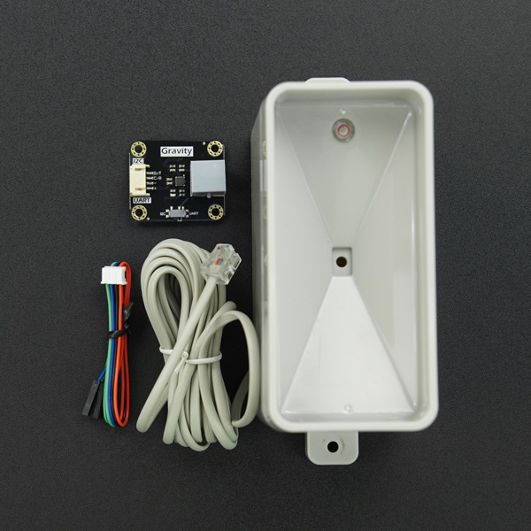

DFRobot_RainfallSensor
===========================
* [中文版](./README_CN.md)

This library provides Arduino IDE and Raspberry Pi software drivers, as well as example code, for the SEN0575 rainfall sensor kit. With this library, users can obtain 24-hour rainfall information, the sensor's operating time, and the accumulated rainfall information during the sensor's operating time through software operations.




## Product Link ([Tipping Bucket Rainfall Measurement Gauge Detector for Weather Station - DFRobot](https://www.dfrobot.com/product-2689.html))
    SKU：SEN0575


## Table of Contents

* [Summary](#summary)
* [Installation](#installation)
* [Methods](#methods)
* [Compatibility](#compatibility)
* [History](#history)
* [Credits](#credits)


## Summary
* Read rainfall sensor data


## Installation

Two methods are provided for using this library:
1. Open the Arduino IDE, go to Tools --> Manager Libraries in the status bar, search for "DFRobot_RainfallSensor" and install the library.
2. First, download the library file and paste it into the \Arduino\libraries directory. Then, open the examples folder and run the demo in that folder.
Note: This library needs to be used with DFRobot_RTU, so make sure to install DFRobot_RTU before using this library.


## Methods

```C++
  /**
   * @fn begin
   * @brief This function will try communicating with the slave and returns the communication result.
   * @return Returns the communication result
   * @retval true  Succeed
   * @retval false Failed
   */
  bool begin(void);

  /**
   * @fn getFirmwareVersion
   * @brief  get firmware version
   * @return  Return  firmware version
   */
  String getFirmwareVersion(void);

  /**
   * @fn getRainfall
   * @brief Get cumulative rainfall
   * @return float Cumulative rainfall
   */
  float getRainfall(void);

  /**
   * @fn getRainfall
   * @brief Get cumulative rainfall within specified time
   * @param hour Specified time (valid settings are 1-24h)
   * @return float Cumulative rainfall
   */
  float getRainfall(uint8_t hour);

  /**
   * @fn getRawData
   * @brief Get the Rawdata object
   * @return Get the number of tipping bucket counts of rainfall, unit count
   */
  uint32_t getRawData();

  /**
   * @fn setRainAccumulatedValue
   * @brief Set the Rain Accumulated Value object
   * @param accumulatedValue Accumulated rainfall value, unit millimeter
   * @return Returns 0 for success, other values for failure 
   */
  uint8_t setRainAccumulatedValue(float accumulatedValue = 0.2794);

  /**
   * @fn getSensorWorkingTime
   * @brief Obtain the sensor working time
   * @return Working time, unit hour
   */
  float getSensorWorkingTime();
```


## Compatibility

MCU                | Work Well    | Work Wrong   | Untested    | Remarks
------------------ | :----------: | :----------: | :---------: | :----:
Arduino Uno        |      √       |              |             |
Arduino MEGA2560   |      √       |              |             |
Arduino Leonardo   |      √       |              |             |
FireBeetle-ESP8266 |      √       |              |             |
FireBeetle-ESP32   |      √       |              |             |
FireBeetle-M0      |      √       |              |             |
Micro:bit          |      √(IIC） |   √(UART)    |             |


## History

- 2023/02/28 - Version 1.0.0 released.

## Credits

Written by fary(feng.yang@dfrobot.com), 2023. (Welcome to our [website](https://www.dfrobot.com/))

