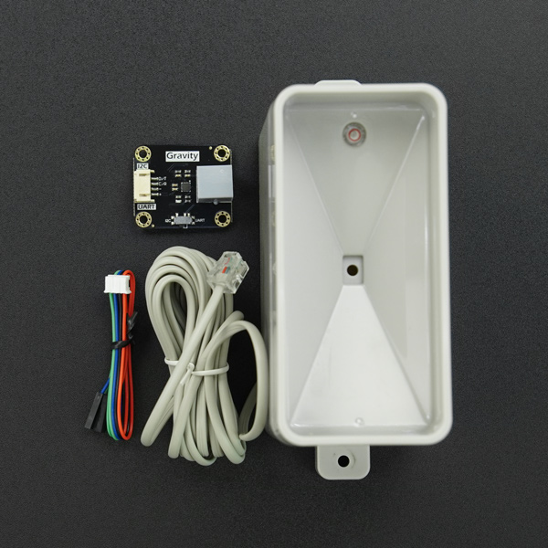

DFRobot_RainfallSensor
===========================

* [English Version](./README.md)

本库为SEN0575 雨量传感器套件提供了Arduino IDE 和树莓派软件驱动以及示例代码，用户可根据此库通过软件操作来获取雨量传感器获取的24小时内的雨量信息、传感器的工作时间以及传感器工作时间内的累计雨量信息。



## 产品链接（[雨量传感器/翻斗式雨量计-其他传感器-DFRobot创客商城](https://www.dfrobot.com.cn/goods-3698.html)）
    SKU：SEN0575

## 目录

  * [概述](#概述)
  * [库安装](#库安装)
  * [方法](#方法)
  * [兼容性](#兼容性)
  * [历史](#历史)
  * [创作者](#创作者)

## 概述
* 读取雨量计数据

## 库安装

要使用库, 首先下载库文件, 将其粘贴到指定的目录中, 然后打开examples文件夹并在该文件夹中运行演示。
本库关联了modbus_tk库，使用前请确保树莓派已经下载了modbus_tk。
```shell
python2 : 
pip2 install modbus_tk smbus
python3:
pip3 install modbus_tk smbus
```
使用本库的串口功能时，请保证树莓派的串口/dev/ttyAMA0 得到了正确的配置

## 方法

```python
  def begin(self)
    '''!
      @brief 本函数将会尝试与从机设备进行通信,根据返回值判断通信是否成功
      @return 返回通信结果
      @retval true  Succeed
      @retval false Failed
    '''

  def get_firmware_version(self)
    '''!
      @brief  get firmware version
      @return  Return  firmware version
    '''

  def get_pid_vid(self)
    '''!
      @brief  获取pid和vid
      @return  Return  true:正确获取，false:获取数据失败或者获取数据错误
    '''


  def get_rainfall(self)
    '''!
      @brief  获取累计雨量
      @return 累计雨量
    '''

  def get_rainfall_time(self,hour)
    '''!
      @brief  获取指定时间内的累计雨量
      @param hour 指定时间(有效设置为1-24小时)
      @return 累计雨量
    '''

  def get_raw_data(self)
    '''!
      @brief 获取原始数据
      @return 雨量的翻斗次数，单位 次
    '''

  def set_rain_accumulated_value(self,value)
    '''!
      @brief 设置雨量累加值
      @param value 雨量累加值，单位为毫米
      @return 返回 0 设置成功，其他值设置失败 
    '''

  def get_sensor_working_time(self):
    '''!
      @brief Obtain the sensor working time
      @return 工作时间,单位小时
    '''
```


## 兼容性

* RaspberryPi 版本

| Board        | Work Well | Work Wrong | Untested | Remarks |
| ------------ | :-------: | :--------: | :------: | ------- |
| RaspberryPi2 |           |            |    √     |         |
| RaspberryPi3 |           |            |    √     |         |
| RaspberryPi4 |     √     |            |          |         |

* Python 版本

| Python  | Work Well | Work Wrong | Untested | Remarks |
| ------- | :-------: | :--------: | :------: | ------- |
| Python2 |     √     |            |          |         |
| Python3 |     √     |            |          |         |


## 历史
- 2023-02-28 - 1.0.0 版本

## 创作者

Written by fary(feng.yang@dfrobot.com), 2023. (Welcome to our [website](https://www.dfrobot.com/))